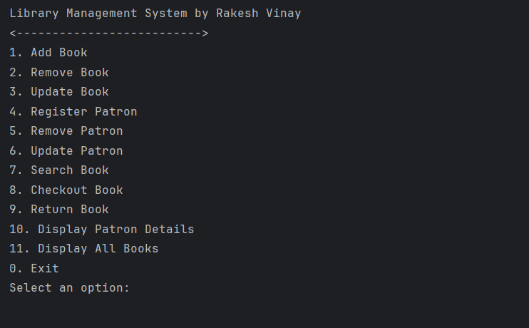
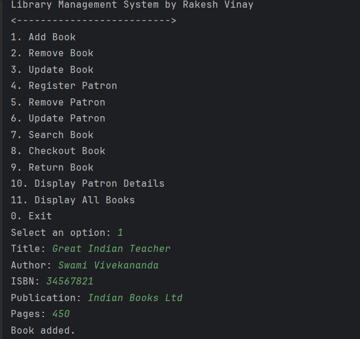
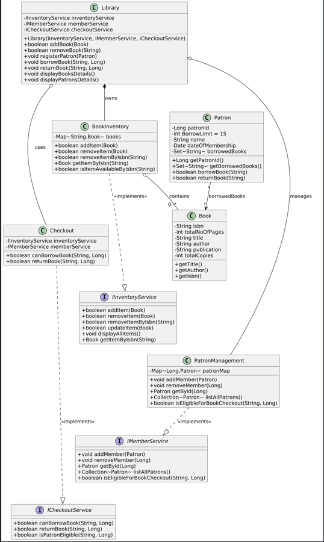

# Library Management System

This is a **Library Management System** built in Java.  
It allows you to **add books, register patrons, borrow and return books, and display library details** — just like a real library.

The design uses **clean architecture** principles:
- **Library** is the *main entry point* (like the Librarian).
- **Books** and **Patrons** are the main data.
- **Services** handle book storage, patron management, and checkout logic.
- **Main class** starts the app and shows a **menu system** for interaction.

---

## 🧠 Intuition Behind the Design

Think of it like a real library:

- The **Library** doesn’t directly keep books or patrons — it asks services to manage them.
- **BookInventory** knows about all the books.
- **PatronManagement** knows about all the patrons.
- **Checkout** decides if a patron can borrow/return a book.
- **Library** just brings these services together.

This separation makes the system **easy to maintain and extend**. For example, if you change how books are stored, Library doesn’t need to change — only `BookInventory`.

---

## 📊 Class Diagram (LLD)

The diagram shows relationships between classes:

- **Library** *has a* Inventory, Patron service, and Checkout service.
- **Inventory** *manages* many Books.
- **PatronManagement** *manages* many Patrons.
- **Checkout** connects Patrons with Books.

---

## 📂 Project Structure

src/
├── LibraryManagement/
│ ├── Main.java # Starts the program
│ ├── Library.java # Facade: exposes high-level operations
│ ├── LibraryMenuHandeling.java # Menu system for user input
│ └── AddTestData.java # Seeds 20 books + 20 patrons
│
├── Models/
│ ├── Book.java # Book entity
│ └── BookInventory.java # Implements IInventoryService
│
├── PatronModels/
│ ├── Patron.java # Patron entity
│ └── PatronManagement.java # Implements IMemberService
│
├── CheckoutModels/
│ └── Checkout.java # Implements ICheckoutService
│
├── Services/
│ ├── IInventoryService.java
│ ├── IMemberService.java
│ └── ICheckoutService.java
│
└── Builders/
├── BookBuilder.java # Helps create Book objects easily
└── PatronBuilder.java # Helps create Patron objects easily

---

## ▶️ How the Program Works

1. **Main.java**
    - Creates services (`BookInventory`, `PatronManagement`, `Checkout`)
    - Wires them together into a **Library** object
    - Seeds 20 books and 20 patrons with `AddTestData`
    - Starts the **LibraryMenuHandeling** (menu system)

2. **LibraryMenuHandeling.java**
    - Shows a menu with options like Add Book, Register Patron, Checkout, Return, etc.
    - Reads user input from the console (Scanner).
    - Calls `library` methods to perform actions.

3. **AddTestData.java**
    - Adds 20 popular books (like *Atomic Habits*, *Clean Code*, *Sapiens*)
    - Adds 20 patrons with different names.
    - Helps test the system quickly without manual input.

---

## 📋 Example Menu (when you run the app)

- Choose options by entering numbers (1-11).
- 

UML Class Diagram:
